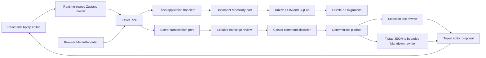

# Speech to Edit

Speech to Edit is a small full-stack rich-text editing application built to explore a safe voice-driven editing workflow. A user writes in a real Tiptap editor, describes a change, reviews a typed proposal, and explicitly applies it as one undoable editor transaction.

The current source includes the complete JSON-backed document spine, browser microphone capture, bounded server transcription, classifier-backed proposal path, and Selection and Document rewrite adapters. The final integration and polish pass is in progress: deterministic checks, browser coverage, and live-provider behavior still need to be reconfirmed before this slice is considered fully verified.

## What the application does

- Runs a long-lived Tiptap and ProseMirror editor with headings, paragraphs, bold, italic, undo, and redo.
- Keeps schema-validated Tiptap JSON as the canonical browser, Effect RPC, and SQLite document representation.
- Autosaves without recreating the editor or discarding its selection and undo history.
- Retains a recoverable local draft when saving fails or conflicts.
- Sends editing instructions to the server as proposal requests.
- Classifies a closed command registry, then invokes a second model only for the single generative rewrite family.
- Rewrites a selection from selected text or rewrites a complete document through a bounded Markdown round trip.
- Shows a typed preview before changing the document.
- Revalidates the captured revision and fingerprint, then applies an accepted proposal as one undoable local transaction.
- Records a bounded thirty-second browser audio instruction and releases microphone resources after stop, cancel, failure, or disposal.
- Validates and transcribes the serialized recording through Effect RPC with either a deterministic test port or a server-only OpenRouter adapter.
- Places the returned transcript into editable review state without automatically proposing or applying an editor change.

Deterministic literal replacement, literal insertion, and explicit mark commands remain locally planned and non-generative. They do not broaden the model boundary or turn the LLM into a router for arbitrary executable editor tools.

## Architecture



### Editor authority

The live Tiptap editor owns document transactions, selection, formatting state, and undo history. The application never remounts the editor merely because a save was acknowledged. Tiptap JSON is projected outward for persistence, while HTML is only a possible derived rendering or export format. See `apps/web/src/editor.tsx` and `packages/editor/src/index.ts`.

### Application runtime

A runtime-owned Zustand store models loading, dirty, saving, ready, failed, and conflicted states. Mutable resources and pending work live in an explicit runtime state structure. The runtime owns Effect RPC acquisition, cancellation, local draft recovery, retries, editor registration, Redux DevTools cleanup, and disposal. See `apps/web/src/runtime.ts` and `apps/web/src/document-model.ts`.

### Client and server boundary

The browser and server communicate through typed Effect RPC contracts for loading, saving, transcription, and proposing editor commands. Voice requests carry operation identity, bounded editor metadata, MIME, duration, declared bytes, and raw base64 audio. The server strictly validates the decoded audio before invoking an injected transcription port. It returns transcript or failure data, never executable editor behavior. See `packages/contracts/src/index.ts`, `packages/voice-capture/src/server.ts`, and `apps/server/src/application.ts`.

### Persistence

SQLite is the durable authority. A repository port separates application behavior from the Node SQLite and Drizzle implementation. Saves use an expected revision so conflicting writes return a typed conflict rather than silently overwriting newer content. Drizzle Kit generates committed migrations, and the server applies them during startup. See `packages/storage-sqlite/src/runtime.ts`, `packages/storage-sqlite/src/schema.ts`, and `packages/storage-sqlite/drizzle/`.

### Speech-command boundary

The speech-command package begins with transcript text and classifies a closed registry. V1 exposes one generative semantic command family, `RewriteContent`, with explicit `Selection` or `Document` scope. The current TypeScript discriminant is `Rewrite`; `RewriteContent` names the product-level boundary. Deterministic literal replacement, literal insertion, and explicit bold or italic commands remain in the registry, but the planner handles them locally without a prose-generation call.

The classifier receives only the transcript plus capability facts such as whether a selection exists and whether the document is empty. A Selection rewrite sends the selected text and bounded instruction to the rewriter. A Document rewrite sends the bounded Markdown projection only after the classifier chooses Document scope. The model never receives an editor instance, emits raw ProseMirror JSON, executes callbacks, or mutates the document directly.

The OpenRouter adapters are available only from the explicit server subpath; the browser-compatible package root does not export them. Classification and rewriting produce serializable decisions and typed proposals. See `packages/speech-command/src/prompt.ts`, `packages/speech-command/src/planner.ts`, and `packages/speech-command/src/openrouter.ts`.

### One vertical slice, explicit ownership

The repository is organized around one browser-to-server editing slice. React and Tiptap own the UI, live document, selection, and transaction history; shared contracts carry serializable JSON through Effect RPC; application use cases coordinate domain and repository ports; and the Drizzle adapter persists the document in SQLite. The browser-only voice-capture package owns microphone resources, hands validated audio to a typed transcription boundary and server-only provider adapter, then passes the transcript through the speech-command classifier, planner, and bounded rewriter. The result returns as a typed editor proposal for client-side preview and explicit Apply.

Packages are separated by authority, lifecycle, and test boundary rather than merely by file type. Each stage can be exercised with deterministic fakes, while the application retains one realistic browser-to-server vertical slice for integration and end-to-end verification.

## Repository layout

```text
apps/
  web/                 React, Tiptap, Zustand, and browser Effect RPC client
  server/              Node Effect RPC server and application handlers
packages/
  contracts/           Effect schemas and RPC contracts
  domain/              Document values and repository ports
  editor/              Tiptap command, capture, preview, validation, and apply port
  speech-command/      Classifier, planner, fixtures, evaluation, and OpenRouter adapter
  voice-capture/       Browser recorder runtime, transport validation, and STT adapter
  storage-sqlite/      Drizzle schema, migrations, and SQLite repository
tools/                 Workspace tooling packages
```

## Prerequisites

The repository includes a devenv configuration and works best with:

- direnv;
- devenv;
- Node.js 24 or newer; and
- pnpm 11.21.0.

If you do not use devenv, install a compatible Node and pnpm version yourself.

## Run locally

Clone the repository, enter its directory, and provision the shell:

```sh
direnv allow
pnpm install --frozen-lockfile
```

Start the web and RPC servers together:

```sh
pnpm dev
```

Then open:

- Web application: http://127.0.0.1:5173
- Effect RPC endpoint: http://127.0.0.1:3001/rpc

The default SQLite database is created beneath the server package at `apps/server/data/speech-edit.sqlite`.

No environment configuration is required for the default local ports and database. Available settings are documented in `.env.example`:

```dotenv
WEB_PORT=5173
SERVER_PORT=3001
DATABASE_PATH=.local/data.sqlite
```

Local environment files are ignored by Git. The application does not automatically load `.env.local`; source it into the shell when using it:

```sh
set -a
. ./.env.local
set +a
pnpm dev
```

## Verification

Run the deterministic checks:

```sh
pnpm typecheck
pnpm test
pnpm build
```

Install the repository-local Playwright browser once, then run the cold-start browser checks:

```sh
pnpm playwright:install
pnpm test:e2e
```

The Playwright configuration starts the RPC server before the web application and uses an isolated SQLite test database. The browser scenarios verify JSON persistence across reload, preservation of undo and redo after autosave, proposal review without premature mutation, explicit application, undo of an accepted proposal, and a fake-microphone recording through transcript review and resource reacquisition.

When the Drizzle schema changes, generate and review a migration:

```sh
pnpm db:generate
```

Commit the generated SQL and Drizzle metadata with the schema change.

## Test the classifier

The deterministic classifier suite does not require a credential:

```sh
pnpm --filter @app/speech-command test
```

For an optional live OpenRouter evaluation, put `OPENROUTER_API_KEY` in the ignored `.env.local`, source it into the shell, and run:

```sh
set -a
. ./.env.local
set +a
pnpm --filter @app/speech-command eval:live
```

The evaluator reports fixture identifiers, latency, pass or fail, and sanitized failure types. It does not report the API key, transcripts, or document prose. The first live evaluation with `openai/gpt-4o-mini` classified all four supported editing requests exactly; the ambiguous and unsupported fixtures failed closed as `InvalidProviderResponse`. Those defensive prompt shapes remain a bounded refinement before autonomous use.

## Deliberate trade-offs

### Explicit review instead of autonomous editing

The server returns typed proposals, but only the browser can apply one after checking that the captured revision and document fingerprint are still current. The model never emits executable callbacks or mutates the editor directly. Accepted Selection and Document rewrites apply as one local transaction, so native Undo restores the captured content.

### Complete replacement proposals instead of minimal diffs

A Selection rewrite replaces the captured range. A whole-document rewrite is a complete document replacement proposal rather than a model-generated minimal diff. This keeps preview, stale validation, application, and undo semantics straightforward; any edit after capture makes the proposal stale.

### JSON authority with transient Markdown interoperability

Tiptap JSON remains canonical in the browser, Effect RPC contracts, and SQLite. Markdown exists only inside the semantic Document rewrite boundary:

```text
validated Tiptap JSON -> Markdown -> LLM -> replacement Markdown
-> deterministic Markdown parser -> schema-valid Tiptap JSON
-> typed proposal -> explicit browser Apply
```

This gives the model a readable, bounded format while project code remains responsible for constructing and validating ProseMirror-compatible JSON. The accepted round-trip covers paragraphs, headings, bold, italic, ordered and bullet lists, and blockquotes well enough for V1. It may normalize or lose custom attributes, comments, mentions, embedded objects, advanced marks, stable node identifiers, and whitespace distinctions. Unsupported Markdown, invalid schema output, empty output, or size and structural limit violations fail closed without producing an applicable proposal. Schema evolution still requires migration and compatibility planning.

### Revision checks instead of collaboration

The application detects conflicting saves with integer revisions and preserves the rejected local draft. It does not provide collaborative cursors, CRDT convergence, Yjs, Hocuspocus, or multi-user identity.

### SQLite instead of a hosted database

SQLite keeps the demonstration local and operationally small. The repository port leaves room for another storage adapter, but authentication, horizontal scaling, backups, and production database operations are outside the current scope.

### Local recovery instead of an offline-first replica

Unsaved Tiptap JSON is retained in browser storage so transient save failures do not discard work. This is a recovery mechanism, not a synchronized offline replica or normalized entity cache.

## Current boundaries

Implemented and verified before the current polish pass:

- JSON-backed Tiptap document editing;
- Effect RPC load, save, and proposal operations;
- SQLite persistence and generated migrations;
- autosave, conflict detection, retry, and local recovery;
- preview, stale validation, explicit apply, and undo;
- isolated speech-command classification and evaluation;
- explicit browser microphone start, stop, cancel, duration, and disposal lifecycle;
- bounded Effect RPC transcription with strict server validation;
- editable transcript review that preserves the original editor capture.

Present in the current integration source, with final verification in progress:

- classifier-backed proposal RPC;
- bounded Selection rewriting through a second model call;
- bounded whole-document JSON-to-Markdown rewriting and deterministic Markdown-to-JSON parsing;
- schema, size, node-count, depth, revision, and fingerprint checks;
- typed whole-document preview and explicit one-transaction Apply.

Still outside V1:

- authentication and user-owned documents;
- real-time collaboration;
- arbitrary model-selected editor tools; and
- lossless Markdown round trips for custom ProseMirror extensions.

## Polish and verification

The final pass should confirm the complete vertical slice without widening the model boundary:

1. Run typechecking, deterministic unit and integration tests, and production builds.
2. Exercise fake-provider Selection and Document rewrites through Effect RPC.
3. Verify that invalid or unsupported Markdown fails closed.
4. Cover whole-document preview, staleness, explicit Apply, and single-step Undo in the browser.
5. Run the optional live-provider evaluation with a server-only credential and sanitized output.

Provider credentials remain on the server throughout this flow.
