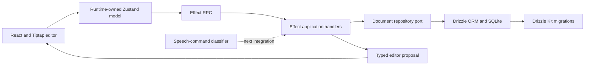

# Speech to Edit

Speech to Edit is a small full-stack rich-text editing application built to explore a safe voice-driven editing workflow. A user writes in a real Tiptap editor, describes a change, reviews a typed proposal, and explicitly applies it as one undoable editor transaction.

The current application includes the complete JSON-backed document spine and a separately tested speech-command classifier. Browser audio capture, transcription, and classifier-to-application wiring are intentionally still in progress.

## What the application does

- Runs a long-lived Tiptap and ProseMirror editor with headings, paragraphs, bold, italic, undo, and redo.
- Persists schema-validated Tiptap JSON through Effect RPC into SQLite.
- Autosaves without recreating the editor or discarding its selection and undo history.
- Retains a recoverable local draft when saving fails or conflicts.
- Sends editing instructions to the server as proposal requests.
- Shows a preview before changing the document.
- Revalidates the captured editor target and applies an accepted proposal as one local transaction.
- Provides a closed, versioned speech-command classifier experiment with an isolated server-only OpenRouter adapter.

The application currently uses a deterministic proposal handler for the integrated editing flow. The model-backed classifier is implemented and tested in isolation but has not yet replaced that handler.

## Architecture



### Editor authority

The live Tiptap editor owns document transactions, selection, formatting state, and undo history. The application never remounts the editor merely because a save was acknowledged. Tiptap JSON is projected outward for persistence, while HTML is only a possible derived rendering or export format. See `apps/web/src/editor.tsx` and `packages/editor/src/index.ts`.

### Application runtime

A runtime-owned Zustand store models loading, dirty, saving, ready, failed, and conflicted states. Mutable resources and pending work live in an explicit runtime state structure. The runtime owns Effect RPC acquisition, cancellation, local draft recovery, retries, editor registration, Redux DevTools cleanup, and disposal. See `apps/web/src/runtime.ts` and `apps/web/src/document-model.ts`.

### Client and server boundary

The browser and server communicate through typed Effect RPC contracts for loading, saving, and proposing editor commands. The server validates document JSON against the configured Tiptap StarterKit schema before exposing or persisting it. See `packages/contracts/src/index.ts` and `apps/server/src/application.ts`.

### Persistence

SQLite is the durable authority. A repository port separates application behavior from the Node SQLite and Drizzle implementation. Saves use an expected revision so conflicting writes return a typed conflict rather than silently overwriting newer content. Drizzle Kit generates committed migrations, and the server applies them during startup. See `packages/storage-sqlite/src/runtime.ts`, `packages/storage-sqlite/src/schema.ts`, and `packages/storage-sqlite/drizzle/`.

### Speech-command experiment

The speech-command package begins with transcript text. It uses a strict prompt and response schema to classify a closed command vocabulary:

- replace literal text;
- insert literal text;
- set bold or italic explicitly; and
- rewrite the current selection.

The OpenRouter implementation is available only from the explicit server subpath; the browser-compatible package root does not export it. Classification produces serializable decisions and proposals rather than executable editor callbacks. See `packages/speech-command/src/index.ts` and `packages/speech-command/src/openrouter.ts`.

## Repository layout

```text
apps/
  web/                 React, Tiptap, Zustand, and browser Effect RPC client
  server/              Node Effect RPC server and application handlers
packages/
  contracts/           Effect schemas and RPC contracts
  domain/              Document values and repository ports
  editor/              Tiptap command, capture, preview, validation, and apply port
  speech-command/      Classifier, planner, fixtures, evaluation, and OpenRouter adapter
  storage-sqlite/      Drizzle schema, migrations, and SQLite repository
tools/                 Workspace tooling packages
```

## Prerequisites

The repository includes a devenv configuration and works best with:

- direnv;
- devenv;
- Node.js 24 or newer; and
- pnpm 11.21.0.

If you do not use devenv, install a compatible Node and pnpm version yourself.

## Run locally

Clone the repository, enter its directory, and provision the shell:

```sh
direnv allow
pnpm install --frozen-lockfile
```

Start the web and RPC servers together:

```sh
pnpm dev
```

Then open:

- Web application: http://127.0.0.1:5173
- Effect RPC endpoint: http://127.0.0.1:3001/rpc

The default SQLite database is created beneath the server package at `apps/server/data/speech-edit.sqlite`.

No environment configuration is required for the default local ports and database. Available settings are documented in `.env.example`:

```dotenv
WEB_PORT=5173
SERVER_PORT=3001
DATABASE_PATH=.local/data.sqlite
```

Local environment files are ignored by Git. The application does not automatically load `.env.local`; source it into the shell when using it:

```sh
set -a
. ./.env.local
set +a
pnpm dev
```

## Verification

Run the deterministic checks:

```sh
pnpm typecheck
pnpm test
pnpm build
```

Install the repository-local Playwright browser once, then run the cold-start browser checks:

```sh
pnpm playwright:install
pnpm test:e2e
```

The Playwright configuration starts the RPC server before the web application and uses an isolated SQLite test database. The browser scenarios verify JSON persistence across reload, preservation of undo and redo after autosave, proposal review without premature mutation, explicit application, and undo of an accepted proposal.

When the Drizzle schema changes, generate and review a migration:

```sh
pnpm db:generate
```

Commit the generated SQL and Drizzle metadata with the schema change.

## Test the classifier

The deterministic classifier suite does not require a credential:

```sh
pnpm --filter @app/speech-command test
```

For an optional live OpenRouter evaluation, put `OPENROUTER_API_KEY` in the ignored `.env.local`, source it into the shell, and run:

```sh
set -a
. ./.env.local
set +a
pnpm --filter @app/speech-command eval:live
```

The evaluator reports fixture identifiers, latency, pass or fail, and sanitized failure types. It does not report the API key, transcripts, or document prose. The first live evaluation with `openai/gpt-4o-mini` classified all four supported editing requests exactly; the ambiguous and unsupported fixtures failed closed as `InvalidProviderResponse`. Those defensive prompt shapes remain a bounded refinement before autonomous use.

## Deliberate trade-offs

### Explicit review instead of autonomous editing

The server proposes typed commands, but only the browser can apply them after checking that the editor capture is still current. This adds a confirmation step while keeping model output away from executable callbacks and preserving meaningful undo behavior.

### Complete range replacement instead of minimal text diffs

Accepted rewrites may replace the captured range in one transaction. The demo prioritizes classification, preview, stale validation, and reversible application over calculating a minimal prose diff.

### JSON document authority instead of HTML persistence

Persisting Tiptap JSON preserves editor structure and makes schema validation explicit. It couples stored documents to a known editor schema, so schema changes require migration and compatibility planning.

### Revision checks instead of collaboration

The application detects conflicting saves with integer revisions and preserves the rejected local draft. It does not provide collaborative cursors, CRDT convergence, Yjs, Hocuspocus, or multi-user identity.

### SQLite instead of a hosted database

SQLite keeps the demonstration local and operationally small. The repository port leaves room for another storage adapter, but authentication, horizontal scaling, backups, and production database operations are outside the current scope.

### Local recovery instead of an offline-first replica

Unsaved Tiptap JSON is retained in browser storage so transient save failures do not discard work. This is a recovery mechanism, not a synchronized offline replica or normalized entity cache.

## Current boundaries

Implemented and verified:

- JSON-backed Tiptap document editing;
- Effect RPC load, save, and proposal operations;
- SQLite persistence and generated migrations;
- autosave, conflict detection, retry, and local recovery;
- preview, stale validation, explicit apply, and undo;
- isolated speech-command classification and evaluation.

Not yet integrated:

- microphone capture and recording lifecycle;
- server-side transcription;
- classifier-backed proposal RPC;
- live selection rewriting through the second model call;
- authentication and user-owned documents;
- real-time collaboration.

## Intended next slice

The next integration keeps the browser and server responsibilities narrow:

1. The browser captures audio and serializable editor context.
2. The server transcribes the bounded recording.
3. The server classifies the transcript and optionally rewrites selected text.
4. Effect RPC returns a typed proposal or modeled failure.
5. The browser displays the transcript and proposal.
6. Apply revalidates the capture and executes one local Tiptap transaction.

Provider credentials remain on the server throughout this flow.
